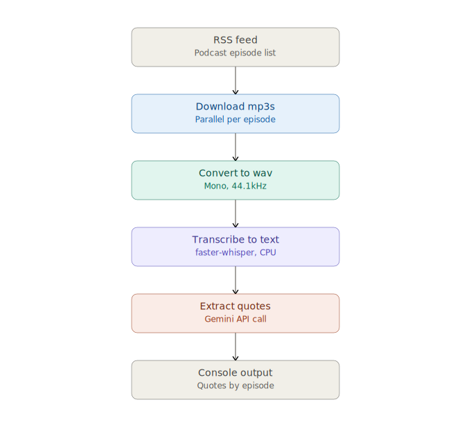

# 🎙️ Podcast Quote Extractor

This tool downloads podcast episodes from an RSS feed, converts them into wav format, transcribes them to text, and uses Google Gemini to search the podcasts transcripts for quotes and return a list containing quotes (if applicable).

## What it does
- Downloads podcast episodes as MP3 files from an RSS feed.
- Converts each MP3 to WAV.
- Transcribes each WAV to text using faster-whisper.
- Sends each transcript to Gemini to extract quotes and their authors.
- Prints all quotes to your console, tagged with the podcast episode they came from.


## Authors

- Robin Sitar (GitHub: [@robinsitar12](https://github.com/robinsitar12))


## Diagram


## Before you start — what you need have installed

| Requirement                                 | Why you need it                                            | How to check if you already have it                                    |
| ------------------------------------------- | ---------------------------------------------------------- | ---------------------------------------------------------------------- |
| Python 3.9 or newer                         | Runs the project's code                                    | Open a terminal and run python --version (or python3 --version on Mac) |
| FFmpeg                                      | Needed by pydub to convert MP3 to WAV                      | Run ffmpeg -version in your terminal                                   |
| A Gemini API key                            | Needed to extract quotes with AI                           | Get one for free at Google AI Studio                                   |
| Python libraries listed in requirements.txt | Power each pipeline step (downloading, transcribing, etc.) | Installed in Step 3 below                                              |


**Installing Python (if you don't have it yet)** 

- Windows: Download from [python.org](python.org/downloads). During installation, check the box "Add Python to PATH" — this step is easy to miss but essential.
- Mac: Download from [python.org](python.org/downloads), or install via Homebrew: brew install python.


**Installing FFmpeg**
- Windows: Download a build from ffmpeg.org/download.html, unzip it, and add the bin folder to your system PATH.
- Mac: Open Terminal and run brew install ffmpeg (requires Homebrew).

## Getting Started
**Step 1: Download the project**

Download or clone this repository to a folder on your computer, e.g. Desktop/podcast-quote-extractor.

**Step 2: Open a terminal and navigate to the project folder**

1. Press the Windows key, type cmd, and press Enter to open Command Prompt.
2. Navigate to the project folder using cd:

```bat
cd Desktop\podcast-quote-extractor
```

**Step 3: Install the required libraries**

```bat
pip install -r requirements.txt
```

This installs every library the project depends on (requests, beautifulsoup4, faster-whisper, google-genai, and more).

If pip isn't recognized, try pip3 or 

```bat
python -m pip install -r requirements.txt.
```

**Step 4: Find your podcast's RSS feed**

This tool needs a podcast RSS feed URL — not a link from Spotify or Apple Podcasts directly. Find your podcast on Apple Podcasts, Spotify, or any other platform, and copy its show page link.

Go to [_getrssfeed.com_](https://getrssfeed.com/) and paste that link. Copy the RSS feed URL it gives you.


**Step 5: Run the program**

Execute the following demand in your command prompt. Make sure that you are in the right file directory

```bat
python main.py
```

You'll be asked for:

- The podcast RSS feed URL (from Step 4)
- A podcast name (used to name the output folder)
- How many episodes to process (1–5)
- Your Gemini API key (hidden while typing, never saved to disk)


## Demo

 **Processing podcast episodes in the terminal using the python script**


**Example result of 2 podcast episodes from Podcast _Modern Wisdom_**


**Output folders**

```bat
<podcast name>/
├── MP3/   (downloaded episodes)
├── WAV/   (converted audio)
└── TXT/   (transcripts)
```


## Limitations & Opportunities

This project is a first working version, built to solve one specific problem: having a **local, self-hosted way to automatically extract quotes from podcast episodes** — without relying on a paid SaaS tool. It's intentionally simple right now, and there's a lot of room to grow.

### Current Limitations

- **No episode selection yet:** You can currently only process the *n* most recent episodes (up to 5) — there's no way to pick a specific episode from further back in the feed.
- **Episode limit is capped at 5:** For now, mainly to avoid overloading your CPU/RAM with parallel downloads and long transcription runtimes, not because of a hard technical ceiling.
- **Runs entirely locally**: Speed eventually depends on your hardware. Transcription especially can take a while on an average laptop CPU — a stronger processor, more RAM, or a GPU-accelerated `faster-whisper` setup would speed this up significantly.
- **Not yet automated end-to-end:** You currently have to run the script manually and answer prompts in the terminal (RSS URL, podcast name, episode count, API key). Long-term, this could run as a scheduled background job instead and run overnight without you worrying about runtimes or CPU/RAM usage during the day.
- **No speaker diarization.** The transcript doesn't distinguish between multiple speakers, which occasionally makes it harder for Gemini to attribute quotes correctly when several people are talking. Currently, the right prompting still promises qualitative results.
- **Fixed extraction prompt.** The prompt sent to Gemini is hardcoded — there's no way yet to customize what you're looking for in the terminal (e.g. only quotes about a specific topic) and only in the appropriate python file directly from the terminal.

### Possible Next Steps

- **Add an interactive episode picker** to fetch and number all available episodes first, then let the user type in which one(s) to process.
- Let the user **customize the Gemini prompt directly from the terminal** (e.g. "only extract quotes about money" or "only extract funny quotes").
- **Add speaker diarization** so quotes can be attributed more reliably, especially in multi-speaker episodes.
- Swap in a **different speech-to-text (STT) model**, or a **different LLM API**, for better speed/accuracy trade-offs.
- Explore **other extraction use cases** beyond quotes — e.g. auto-generating episode summaries, or pulling out books/resources mentioned in an episode.
- Package the pipeline as a **scheduled/background job** instead of a manual terminal run.

### Reusable building blocks

Even in its current state, the individual pipeline steps are useful on their own and don't require the full pipeline to run:

- **RSS → MP3 downloader:** Reusable any time you just want to bulk-download podcast episodes from a feed.
- **MP3 → WAV converter:** Reusable for any audio processing task that needs WAV input.
- **WAV → text transcriber:** Reusable as a general local speech-to-text tool, independent of podcasts.

Each of these lives in its own file (`rss_downloader.py`, `mp3_to_wav.py`, `wav_to_txt.py`) and can be imported and used standalone in other projects.

## Tech Stack

requests · beautifulsoup4 · lxml · tenacity · tqdm · pydub · faster-whisper · google-genai
